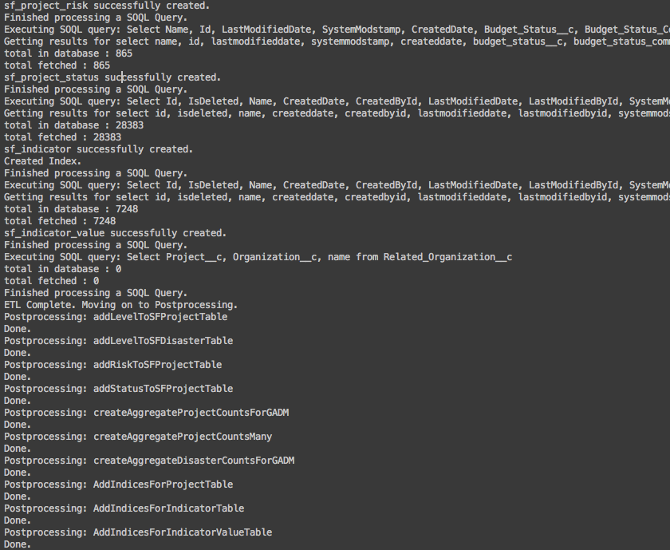

# SalesForce ETL Process

The Salesforce ETL process (/Succubus) is a Node.js project that connects to a Salesforce API instance, uses SOQL to query system tables, and places the results into a separate PostgreSQL instance.

Once in the PostgreSQL instance, postprocessing operations are done to calculate aggregations of project counts/disaster counts per boundary, and also creates tables that store the the relationships between various boundary levels.

ETL console output.

##Main Components

In general, there are 3 main steps:

1) Preprocessing operations - the logic specified here is run first.  This involves dropping tables and views in preparation for new data creation that will happen in step 2.

2) ETL - The meat of the operation.  Using the SOQL queries in [/Succubus/salesforce-queries.js](../Succubus/salesforce-queries.js), the Salesforce API is hit.  Results are returned and inserted in to a postgres DB.

3) Postprocessing operations - after all of the data from Salesforce is inserted in Postgres, more SQL logic is executed to massage the tables, create relationships, add indices and create aggregation tables.

###Preprocessing

Preprocessing logic is stored in /Succubus/preprocessing_operations.  Currently, this logic drops 4 postgres views.

Additionally (and importantly), the preprocessing_operations/index.js file requires meta.js.  This file reaches into ECOS and requests metadata about Project and Disaster fields.

The results of these queries are written to .json files and stuffed into the /GeoAngular/app/succubus_gitignore folder.  The files are used to alias ECOS properties that come back from database calls (so we have human readable labels in the details panel and the filters panels, for example).

###ETL

The ETL controller is /Succubus/pg.js. It relies on salesforce-queries.js to call SOQL queries against the Salesforce API.

If new info is desired to be pulled out of Salesforce and stored in PostgreSQL, this is the place to define it.

The ETL actually *Drops* all tables and views, and then recreates them every time the script is run.  This is to avoid problems with detecting deltas. At some point, if there is enough data in Salesforce, this strategy may need to be re-evaluated.

###Postprocessing

Postprocessing events happen after Preprocessing and ETL steps have run.

These operations add columns to tables, create aggregation tables, add indices.

One example is the execution of a .sql file stored in /Succubus/sql - called createAggregatedProjectCountsMany.sql

This file arranges a wide table that starts at the lowest level (5), and begins counting projects within each boundary.  This count is carried over and added to the counts at the level above (4), and so on, all the way up to Arc Regions.

This is the main table used for map display, map label display, and filtering operations.  If a new filter is desired for a particular column, the column will nee to be added to this .sql file so it becomes available in the aggregation table definition.

##Setting up Cron to run the ETL every night

Setting up cron to run succubus nightly on Ubuntu 14.04 machine
    
    crontab -e

opens chooser for editor.
    
    2
    
At the bottom, enter:

    01 01 * * * cd ~/Mapfolio/GeoForce/Succubus && nodejs index.js

This specifies at 1:01 AM every day, run node and point to succubus’ index.js
    
Note that although it saves this to a temporary directory, the changes are indeed made with the cron system service.

