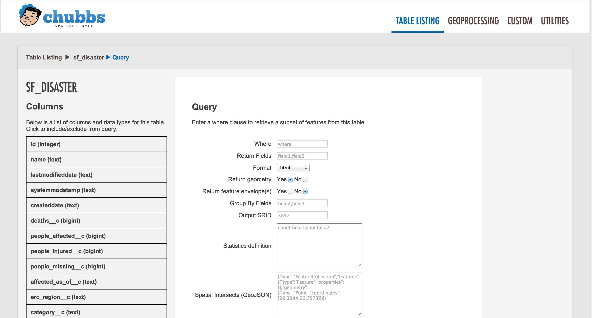

#Red Cross Spatial Server

The Red Cross instance of Spatial Server is a customized branch of [Spatial Server](https://github.com/spatialdev/PGRestAPI).
It is a Node.js application that has many features.  Find out more about the features of Spatial Server by visiting the [docs](https://github.com/spatialdev/PGRestAPI).

Several differences exist between the main branch and this version, notably the OAuth Integration for security.
There is also custom logic specific to this project that has been added.

SpatialServer UI.

##Installation
See either [this](Docs/installation.md) or [this](https://github.com/spatialdev/PGRestAPI#installation) for installation instructions.
Note that the 2nd link is for general installation instructions for Spatial Server, not this specific Red Cross instance.

##Custom Endpoints
The Mapfolio application makes use of Spatial Server's Custom Endpoint functionality.  Developers can write custom API logic and drop the .js file into /Endpoints/Custom/Operations to get their custom logic exposed RESTfully.

Some of the main custom endpoints used for Mapfolio are:

* GetProjectByGUID
* GetDisasterByGUID
* GetALLAggregatedThemeFeatures
* DoECOSTextSearch

If there is a problem with what's being shown not jiving with filters, then these services may play a part and will likely need to be updated.

###GetProjectByGUID
When a user clicks on a country or region on the map while the 'Project' theme is active, then this web service gets called.
It accepts a GUID, a GADM Level (-1 thru 5) and optional filters.
Example:

    /services/custom/custom_operation?name=getprojectbyguid&format=json&guids=da7e557d-39a1-4174-844f-227353bc25b6&gadm_level=0&filters=sector__c%20LIKE%20%27%Health%%27

The response includes ProjectID, Name, Dates and other important project information specified by Red Cross.

###GetDisasterByGUID
When a user clicks on a country or region on the map while the 'Disaster' theme is active, then this web service gets called.
It accepts a GUID, a GADM Level (-1 thru 5) and optional filters.
Example:

    /services/custom/custom_operation?name=getdisasterbyguid&format=json&guids=8faaa5f4-531c-4e9b-8b60-28c301d0cf18&gadm_level=0&filters=iroc_status__c%20LIKE%20%27%Monitoring%%27OR%20iroc_status__c%20LIKE%20%27%Active%%27%20OR%20iroc_status__c%20LIKE%20%27%Inactive%%27

The response includes DisasterID, Name, Dates and other important disaster information specified by Red Cross.

###GetAllAggregatedThemeFeatures
When a user selects a new ECOS Theme (such as Project, Disaster, Project Risk, Project Health or Disaster Type), this web service gets called.
It accepts a theme (project, projectRisk, projectHealth, disaster, disasterType), a GADM Level (-1 thru 5) and optional filters.
Example:

    /services/custom/custom_operation?name=getallaggregatedthemefeatures&format=geojson&theme=project&gadm_level=0
    
A featureCollection is returned.
The response includes a theme_count - depending on the theme, it will contain the number of projects at OR below a given boundary level.
The response also includes the GUID (the unique identifier for each boundary geometry)
The response also include the theme name.

This information is subsquently used to join to the in-memory vector tiles that have already been loaded onto the map.
The theme_counts are appened to the properties of each feature, which are then used to symbolize or color-code the map.

###DoECOSTextSearch
When a user searches for project or disaster info via a textbox, then this web service gets called.
It accepts a search string, and executes a text search on 2 tables, combining the results in the output.
Example:

    /services/custom/custom_operation?name=doecostextsearch&format=json&text=Typ
    
The response includes Project or DisasterID, Name, Dates and other important disaster information specified by Red Cross.

##Running The App
After private/settings.js has been completed with the correct DB connection info, cd to /Chubbs and `node app.js`
This should start the Node.js API, and start serving the static GeoAngular assets.
Navigating to IP:3001 (or your port) should open the mapfolio web application.

On a production server, we use either [Forever](https://github.com/foreverjs/forever) or [PM2](https://github.com/Unitech/pm2).

On the staging and production machines, we are currently using forever.

To start the app with forever (so you can log off and have the app still run), after everything is installed and configured, first test the app:

In /Chubbs,

    npm app.js
    
If you see any errors, address them (I know that's not very helpful) and run again until you see lists of tables and routes being written out to the console.

If the test run works, then kill it (Ctrl + C) and start app.js with forever:

    sudo forever start app.js
    
    
    
## Configuring NGINX as a reverse proxy
Typical Node.js installations run on a port greater than 3000.  In order to allow people to connect to the server on the default HTTP port (80), we install and configure NGINX to act as a reverse proxy.
This means that requests to the URL on port 80 will be read by NGINX and forwarded to port 3001 (or whatever it says in /Chubbs/private/settings.js).

I won't try to explain how to intall NGINX, or talk about what it is. 

I'll show you the config running on the staging server:

    # the IP(s) on which your node server is running. I chose port 3001.
    upstream app_geoforce {
        server 127.0.0.1:3001;
    }
    
    server {
        listen 0.0.0.0:80;
        server_name 54.187.215.30;
        access_log /var/log/nginx/geoforce.log;
    
        # pass the request to the node.js server with the correct headers and much more can be added, see nginx config options
        location / {
          #auth_basic "Restricted";
          #auth_basic_user_file /home/ubuntu/Mapfolio/GeoForce/GeoAngular/app/.htpasswd;
          proxy_set_header X-Real-IP $remote_addr;
          proxy_set_header X-Forwarded-For $proxy_add_x_forwarded_for;
          proxy_set_header Host $http_host;
          proxy_set_header X-NginX-Proxy true;
    
          proxy_pass http://app_geoforce;
          proxy_redirect off;
        }
    }

The upstream block says that we've got an app running locally on 3001, and we'll alias it app_geoforce.

The server block says to listen on port 80 for incoming requests to the ip 54.187.215.30 (if we have a domain name tied to this IP, use the domain name instead).

The location / block says that for all requests to any route on port 80, we will set some headers, and then pass the request off to app_geoforce.

Optionally, to put in place basic NGINX authentication, uncomment the auth_basic and auth_basic_user_file lines.

For more information about installing NGINX, and how to create the .htpasswd file for simple authentication, see [Installation](installation.md)

To see how NGINX is setup on the prod machine, [see this](InstallAndSetupNotes/nginx_ssl_setup.txt)

