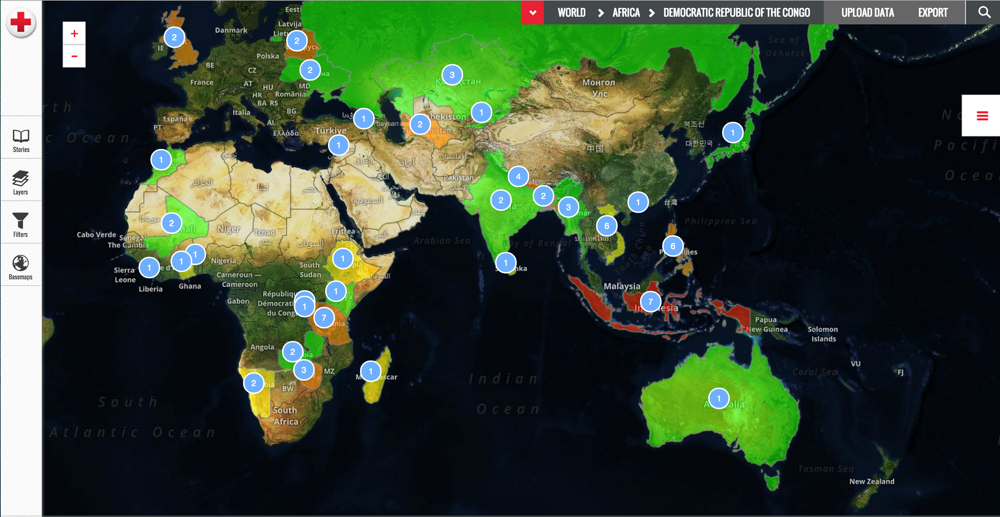

#Vector Tiles styling in Mapfolio

Mapfolio uses Mapbox Vector Tiles created in Mapbox Studio to display global boundary layers.

The boundary layers are unstyled, and only contain a minimal set of attributes.  

In order to create choropleth maps using vector tiles, values for each boundary need to be fetched and merged into the vector tiles data set at run time.
 

Example of choropleth map in Mapfolio

##Styling Vector Tiles

Before we begin, let's take a moment to think about what vector tiles look like in memory after they're parsed on the client.

A single vector tile may contain one or more 'layers' inside of it.  In the case of Mapfolio, each GADM vector tile layer has 2 layers: GADM_2014 and GADM_2014_label.

* GADM_2014 - This is the polygon layer.  It draws the boundaries.  The properties are name_0, id_0 and guid.
* GADM_2014_label - This is a point layer.  One point per boundary, hopefully near the centroid.  The properties are name_0, id_0 and guid.

Once delivered to the client and parsed the VectorTileLayer will look like this:

    ---MVTSourceLayer (Master Layer)
    
        --- MVTLayer (GADM_2014)
        
            --- features: [ MVTFeature, MVTFeature, MVTFeature... ]
        
        
        --- MVTLayer (GADM_2014_label)
    
            --- features: [ MVTFeature, MVTFeature, MVTFeature... ]
        

The important thing to note is the MVTFeatures that make up each layer inside of the vector tile.

Inpsecting an MVTFeature in debugging tools, you will notice that an MVTFeature has a 'properties' object (same as GeoJSON).

Before each feature is rendered on the map, the feature's properties are passed to a Style function.  The developer can use any logic desired to turn the properties into a style.

In the case of Mapfolio, we attach numeric properties (# of projects or disasters), and use the style function to examine this property to decide how to color code the feature.

###Example Simple Styling Function
The style function is specified in the Layer constructor's options object (a full layer definition will be included below).

      style: function (feature) {
        var style = {};
    
        var type = feature.type;

        style.color = fillColor;
        style.outline = {
          color: strokeColor,
          size: 1
        };
        style.selected = {
          color: 'rgba(255,140,0,0.3)',
          outline: {
            color: 'rgba(255,140,0,1)',
            size: 2
          }
        };

        return style;
      }

As you might be able to see, the style accepts a feature (an MVTFeature).  The feature has properties such as 'type' (point line or polygon), and also has 'properties'.

In the simple example above, type and properties are not used to define the style.  Instead each feature in this layer will be styled the same way.

###Mapfolio Styling

The logic for Mapfolio styling is much more dynamic - as there are multiple themes, each with their own logic used to decide what rendering looks like.

This logic is defined [here](../Config/layers/vectortiles.js).

    function getThemeStyle(vtf){
    
      var ecos_border_thickness = 1; //px - this is the thickness of boundaries that have ecos data associated
      var ecos_border_color = "rgba(140,140,140,1)";
    
      var style = {};
      //Default style for all boundaries - make hollow, with a thin outline.
      style.color = 'rgba(0,0,0,0.1)';
      style.outline = {
        color: 'rgba(20,20,20,0.5)',
        size:.5
      };
    
      //Grab the MVTFeature's properties
      var properties = vtf.properties;
    
      //Skip if we're a regular polygon, and not a label point, and if there are no ECOS properties.
      if(vtf.layer.name.indexOf('label') == -1 && !properties.theme){
        return style;
      }
    
      //Variable to store whether or not theme bubbles are on or not.
      var checked;
    
      //See if we should show theme badges/bubbles or not
      if($stateParams.themelabels !== null && $stateParams.themelabels !== undefined){
        checked = $stateParams.themelabels;
      }
      else{
        //if not present, default to true
        checked = 'true';
      }
    
      //A variable to store the particular theme-specific values.
      var ecosProperties;
    
      //Change the style based on the currently selected theme
      if (properties.theme == "disaster") {
        ecosProperties = properties["ecos_properties"]["disaster"];
    
        if (ecosProperties) {
          if (ecosProperties.iroc_status__c) {
          
            //Keep track of the property name for the sake of legend display
            style.legendLabel = ecosProperties.iroc_status__c;
    
            switch (ecosProperties.iroc_status__c.toLowerCase()) {
              case "active":
                style.color = 'rgba(204,0,51,' + opacity + ')';
                style.outline = {
                  color: ecos_border_color,
                  size: ecos_border_thickness
                }
                break;
              case "monitoring":
                style.color = 'rgba(204,153,0,' + opacity + ')';
                style.outline = {
                  color: ecos_border_color,
                  size: ecos_border_thickness
                }
                break;
              case "inactive":
                style.color = 'rgba(255,255,255,' + opacity + ')';
                style.outline = {
                  color: ecos_border_color,
                  size: ecos_border_thickness
                }
                break;
            }
          }
        }
    
      }
      else if (properties.theme == "disasterType") {
        ecosProperties = properties["ecos_properties"]["disasterType"]; //this is an array of disaster types for this area
        if (ecosProperties && ecosProperties.disaster_type__c) {
    
          //Keep track of the property name for the sake of legend display
          style.legendLabel = ecosProperties.disaster_type__c;
    
          //Use the status to color the regions by status.
          if (ecosProperties.iroc_status__c) {
    
            switch (ecosProperties.iroc_status__c.toLowerCase()) {
              case "active":
                style.color = 'rgba(204,0,51,' + opacity + ')';
                style.outline = {
                  color: ecos_border_color,
                  size: ecos_border_thickness
                }
                break;
              case "monitoring":
                style.color = 'rgba(204,153,0,' + opacity + ')';
                style.outline = {
                  color: ecos_border_color,
                  size: ecos_border_thickness
                }
                break;
              case "inactive":
                style.color = 'rgba(255,255,255,' + opacity + ')';
                style.outline = {
                  color: ecos_border_color,
                  size: ecos_border_thickness
                }
                break;
            }
          }
          else{
            //Look up the color in the dictionary, if status property is not around
            style.color = UNOCHAIconLookup[ecosProperties.disaster_type__c[0]].color;
    
            //Use the same outline
            style.outline = {
              color: ecos_border_color,
              size: ecos_border_thickness
            }
          }
    
          if(checked == 'true'){
            //Disaster Type should use OCHA icons
            //But replace the opacity with solid fill for the bubble
            var bubble_fill = style.color.replace("," + opacity + ")", ",1)");
            style.staticLabel = function () {
              var labelStyle = {
                html: (ecosProperties && ecosProperties.disaster_type__c[0] ? buildDisasterTypeLabel(ecosProperties.disaster_type__c[0], bubble_fill, style.outline) : ""),
                iconSize: [42, 42],
                cssClass: 'noclass'
              };
              return labelStyle;
            };
          }
    
    
        }
      }
      else if (properties.theme == "projectRisk") {
        ecosProperties = properties["ecos_properties"]["projectRisk"];
        if (ecosProperties && ecosProperties.overall_assessment__c) {
          //Keep track of the property name for the sake of legend display
          style.legendLabel = ecosProperties.overall_assessment__c;
    
          switch (ecosProperties.overall_assessment__c.toLowerCase()) {
            case "critical":
              style.color = 'rgba(255,0,0,' + opacity + ')';
              style.outline = {
                color: ecos_border_color,
                size: ecos_border_thickness
              }
              break;
            case "high":
              style.color = 'rgba(255,127,0,' + opacity + ')';
              style.outline = {
                color: ecos_border_color,
                size: ecos_border_thickness
              }
              break;
            case "medium":
              style.color = 'rgba(255,255,0,' + opacity + ')';
              style.outline = {
                color: ecos_border_color,
                size: ecos_border_thickness
              }
              break;
            case "low":
              style.color = 'rgba(0,255,0,' + opacity + ')';
              style.outline = {
                color: ecos_border_color,
                size: ecos_border_thickness
              }
              break;
          }
        }
      }
      else if (properties.theme == "projectHealth") {
        ecosProperties = properties["ecos_properties"]["projectHealth"];
        if (ecosProperties && ecosProperties.overall_status__c) {
          //Keep track of the property name for the sake of legend display
          style.legendLabel = ecosProperties.overall_status__c;
    
          switch (ecosProperties.overall_status__c.toLowerCase()) {
            case "red":
              style.color = 'rgba(255,0,0,' + opacity + ')';
              style.outline = {
                color: ecos_border_color,
                size: ecos_border_thickness
              }
              break;
            case "yellow":
              style.color = 'rgba(255,255,0,' + opacity + ')';
              style.outline = {
                color: ecos_border_color,
                size: ecos_border_thickness
              }
              break;
            case "green":
              style.color = 'rgba(0,255,0,' + opacity + ')';
              style.outline = {
                color: ecos_border_color,
                size: ecos_border_thickness
              }
              break;
            case "white":
              style.color = 'rgba(255,255,255,' + opacity + ')';
              style.outline = {
                color: ecos_border_color,
                size: ecos_border_thickness
              }
              break;
          }
        }
      }
      else if (properties.theme == "project") {
        ecosProperties = properties["ecos_properties"]["project"];
    
        if (ecosProperties && ecosProperties) {
    
          //Keep track of the property name for the sake of legend display
          style.legendLabel = "#Projects";
    
          //for the purposes of showing a legend, keep this gradient handy
          style.gradient = [
            'rgba(255,255,255,' + opacity + ')',
            'rgba(0,255,59,' + opacity + ')'
          ];
    
          var count =  parseInt(ecosProperties.theme_count);
    
          if(count == 0) {
            //make hollow
            style.color = 'rgba(0,0,0,' + opacity + ')';
            style.outline = {
              color: ecos_border_color,
              size: ecos_border_thickness
            }
          }
          else if(count > 0 && count <= 2) {
            //make hollow
            style.color = 'rgba(229,255,235,' + opacity + ')';
            style.outline = {
              color: ecos_border_color,
              size: ecos_border_thickness
            }
          }
          else if(count > 2 && count <= 5) {
            //make hollow
            style.color = 'rgba(169,255,189,' + opacity + ')';
            style.outline = {
              color: ecos_border_color,
              size: ecos_border_thickness
            }
          }
          else if(count > 5 && count <= 8) {
            //make hollow
            style.color = 'rgba(169,255,125,' + opacity + ')';
            style.outline = {
              color: ecos_border_color,
              size: ecos_border_thickness
            }
          }
          else if(count > 8 && count <= 10) {
            //make hollow
            style.color = 'rgba(41,255,90,' + opacity + ')';
            style.outline = {
              color: ecos_border_color,
              size: ecos_border_thickness
            }
          }
          else if(count > 10) {
            //make hollow
            style.color = 'rgba(0,255,59,' + opacity + ')';
            style.outline = {
              color: ecos_border_color,
              size: ecos_border_thickness
            }
          }
    
        }
        else{
          //make hollow
          style.color = 'rgba(0,0,0,' + opacity + ')';
          style.outline = {
            color: ecos_border_color,
            size: ecos_border_thickness
          }
        }
      }
    
    
      //if(!hatchDesign){
      //  hatchDesign = getImageRef();
      //}
    
      //style.selected = {
      //  color: function(ctx2d){
      //    //Hatch symbol
      //    var repeat = ctx2d.createPattern(hatchDesign, "repeat");
      //    return repeat;
      //
      //  },
      //  outline : {
      //    color: 'rgb(255,255,0)',
      //    size: 2
      //  }
      //}
    
      style.selected = {
        //color: 'rgba(0,255,255,0.1)',
        color: style.color,
        outline : {
          color: 'rgba(0,255,255,1)',
          size: 2
        }
      }
    
      //Label
      if(checked == 'true') {
    
        if (vtf.layer.name === 'GADM_2014_label') {
          if (ecosProperties && ecosProperties.theme_count) {
    
            if (properties.theme != "disasterType") {
              //Disaster Type labels are set in the bloc above
              //All others are set here.
    
              style.staticLabel = function () {
                var labelStyle = {
                  html: (ecosProperties && ecosProperties.theme_count ? buildDynamicLabel(ecosProperties) : ""),
                  iconSize: [42, 42],
                  cssClass: 'noclass'
                };
                return labelStyle;
              };
    
            }
    
          }
          else {
            //When switching themes, reset old label styles to null so labels don't get drawn for old theme.
            style.staticLabel = null;
          }
    
        }
      }
    
      return style;
    }
    
The above code shows styling options for polygons.

In general, the returned style object should contain;

    color: either rgb or rgba or hex values.
    outline: an object that should contain a color and size(thickness) property.
    
When a user clicks on a feature, it is set to a 'selected' state.

If you provide a style.selected, it will be used to draw the feature when it is in the selected state.

In the case of Mapfolio, all features share the same selected state, so we add it below all of the theme-checking if statements:

          style.selected = {
            color: style.color,
            outline : {
              color: 'rgba(0,255,255,1)',
              size: 2
            }
          }
          
What's happening here is that the (fill) color is being used from whatever was set above, but the outline is being changed to be cyan.

### Map Labels

Map labels are a little tricky.  The Leaflet.MapboxVectorTile plugin supports placing regular Leaflet Marker Icons at point locations specified in a supplemental vector tile layer.

In our case, the GADM_2014_label layer (that is part of each vector tile) contains point geometries.  We *could* draw the points in canvas, and even attach text to them, but they wouldn't be very interactive.
Instead, we use the style function to create Leaflet Marker Icons for each point feature coming out of the vector tile layer.

Observe:

            if (vtf.layer.name === 'GADM_2014_label') {
              if (ecosProperties && ecosProperties.theme_count) {
        
                if (properties.theme != "disasterType") {
                  //Disaster Type labels are set in the bloc above
                  //All others are set here.
        
                  style.staticLabel = function () {
                    var labelStyle = {
                      html: (ecosProperties && ecosProperties.theme_count ? buildDynamicLabel(ecosProperties) : ""),
                      iconSize: [42, 42],
                      cssClass: 'noclass'
                    };
                    return labelStyle;
                  };
        
                }
        
              }
              else {
                //When switching themes, reset old label styles to null so labels don't get drawn for old theme.
                style.staticLabel = null;
              }
        
            }
            
            
style.staticLabel defines a function that returns an HTML snippet (to be placed inside the marker icon), a size for the icon, and a cssClass that can be used to manipulate the CSS styling of the marker.

###Layer Link
Another function in the layer's constructor object is called layerLink:

    layerLink: function (layerName) {
        if (layerName.indexOf('_label') > -1) {
          return layerName.replace('_label', '');
        }
        return layerName + '_label';
      }
      
layerLink defines a relationship between a rendered vector tile layer (GADM boundaries) and each feature's associated point (marker) layer.
This is important - when clicking on a marker icon, it should not only highlight/select the marker icon, but also the boundary assocated with the marker, and vice versa.

This function returns the name of the label layer (if one is present).  (This is why it's important that the 2 layers in the Vector Tile layer are named GADM_2014 and GADM_2014_label)